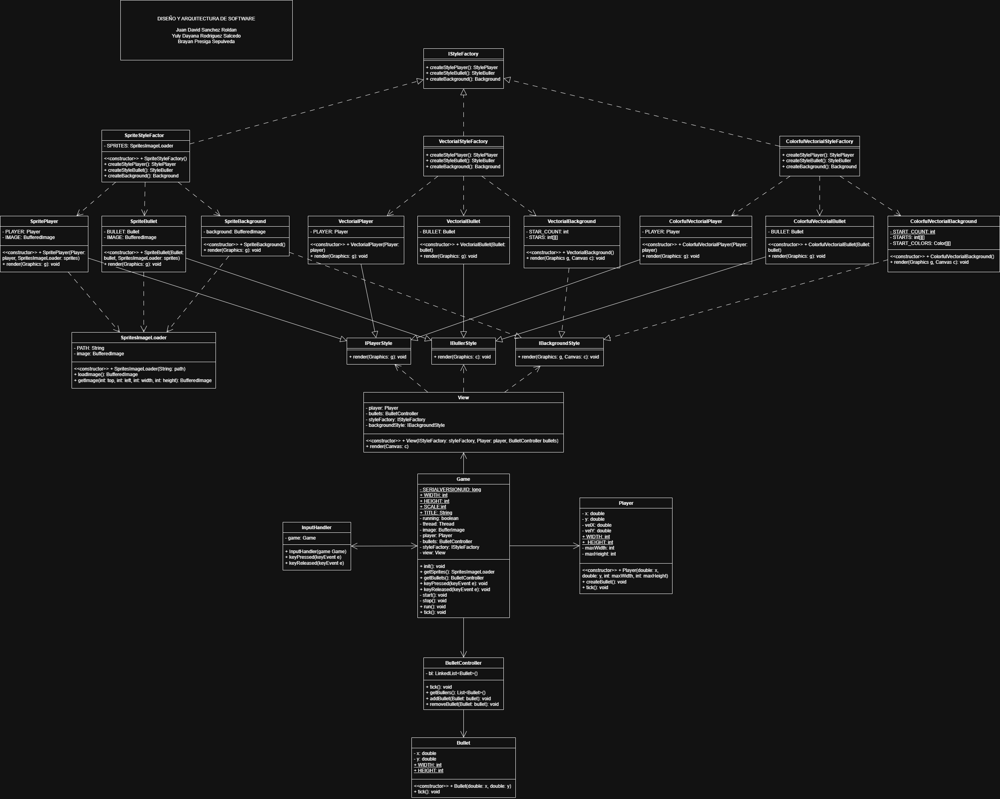

# 🎮 Game Architecture – Implementación Abstract Factory

Integrantes del equipo:

- Brayan Presiga Sepulveda - 0000301424
- Juan David Sanchez Roldan - 0000340321
- Yuly Dayana Rodríguez Salcedo -0000305314

## 📌 Descripción

Este proyecto implementa un videojuego aplicando el patrón de diseño **Abstract Factory**, garantizando desacoplamiento entre la lógica del juego y su representación visual.

La arquitectura permite cambiar completamente el estilo gráfico sin modificar la lógica principal del juego.

---

## 🖼 Diagrama de Arquitectura

> Asegúrese de guardar la imagen dentro de una carpeta `images/` con el nombre `diagrama.png`

---

## 🎯 Requisitos del Ejercicio Cumplidos

### 1️⃣ La vista no depende de implementaciones concretas

En la clase `View`:

- No existen referencias a `Player` concreto
- No existen referencias a `Bullet` concreta
- No existen referencias a renderers específicos

La vista trabaja únicamente con las abstracciones:

- `IPlayerStyle`
- `IBulletStyle`
- `IBackgroundStyle`
- `IStyleFactory`

✔ Se cumple el principio de **Inversión de Dependencias**.

---

### 2️⃣ No existe código duplicado (DRY)

Las implementaciones concretas:

- `SpriteStyleFactory`
- `VectorialStyleFactory`
- `ColorfulVectorialStyleFactory`

Comparten contrato común y responsabilidades separadas, evitando duplicación de lógica.

✔ Se cumple el principio **DRY (Don't Repeat Yourself)**.

---

Estilos Implementados
### 🟢 Estilo 1 – Sprite

- Renderizado mediante imágenes (BufferedImage)
- Basado en sprites
- Para activarlo, descomentar en Game.java línea 61:

// styleFactory = new SpriteStyleFactory();

### 🔵 Estilo 2 – Vectorial

Implementado usando primitivas geométricas:

- g.drawLine()
- g.drawOval()
- g.fillRect()

Para activarlo, descomentar en Game.java línea 66:

styleFactory = new VectorialStyleFactory();

### 🟣 Estilo 3 – Vectorial Colorido

- Basado en primitivas geométricas
- Implementación con variación de colores

// styleFactory = new ColorfulVectorialStyleFactory();

### ⚙️ Funcionamiento General

- Game instancia una StyleFactory.
- View recibe la fábrica.
- La vista crea los estilos usando abstracciones.
- La lógica del juego funciona independientemente del estilo gráfico.

### 🧩 Beneficios

- Arquitectura extensible
- Bajo acoplamiento
- Fácil mantenimiento
- Cambio de estilos sin modificar lógica
- Cumplimiento de principios SOLID
